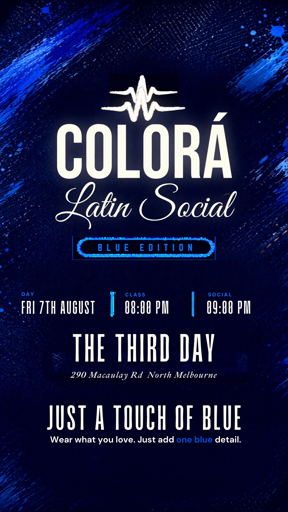

# COLORÁ · Latin Social — "Blue Edition" announcement reel

A 35-second, beat-synced vertical (1080×1920) promo reel announcing the COLORÁ
Latin Social **Blue Edition** night, built entirely from the event flyer's own
artwork.



## Deliverables
| File | Notes |
|------|-------|
| `COLORA_BlueEdition_reel_1080x1920.mp4` | Delivery master · H.264 High · AAC · ~40 MB |
| `COLORA_reel_share_20MB.mp4` | Lightweight share copy (~20 MB) for messaging/upload |
| `poster.png` | Thumbnail / cover still |

## Concept
One continuous high-energy "smash reel": the COLORÁ mark reveals from its pulse
logo, the bachata couple bursts to life, then the key facts slam in on the beat —
each cut hidden inside an electric-cobalt paint strobe.

## On-screen copy (pulled pixel-exact from the flyer)
- **COLORÁ** · *Latin Social* · **BLUE EDITION**
- **SALSA Y BACHATA** — CLASS | SHOWS
- **DAY:** FRI 7TH AUGUST · **CLASS:** 08:00 PM · **SOCIAL:** 09:00 PM
- **Venue:** THE THIRD DAY — 290 Macaulay Rd, North Melbourne
- **DRESS CODE: BLUE** — *Just a touch of blue. Wear what you love. Just add one blue detail.*
- **PROMO CODE:** COLORABLUE — *Save $$$ by getting your ticket online. Code expires this Sunday, 26th July.*

## Run order (beat-driven, ~125 BPM)
`logo reveal → SALSA Y BACHATA → couple dance → BLUE EDITION → details
(day/class/social + venue) → DRESS CODE: BLUE → PROMO CODE → outro summary hold`

## Look
Navy canvas `#0A0E1A`, electric-cobalt paint `#0068F8`, cream `#F0E8D8`; denim +
gold-stitch textures; cobalt/contrast grade with light sweeps, camera shake on
impacts, and paint-strobe cuts.

## Audio
Synthesised Latin bed: son-clave (3-2) + kick + sub-bass + shaker at ~125 BPM,
with risers and sub-bass impacts landing on every cut.

## Rebuild
```bash
pip install cairosvg pillow numpy imageio-ffmpeg
cd src
python3 render_reel.py full     # renders 1050 frames -> frames/
python3 make_audio.py           # -> beat.wav
bash assemble.sh                # -> edit/*.mp4
```
Source flyer layers (SVG) are rendered to `src/layers/` by the build. Copy is
composited straight from the flyer artwork, never re-typed.
